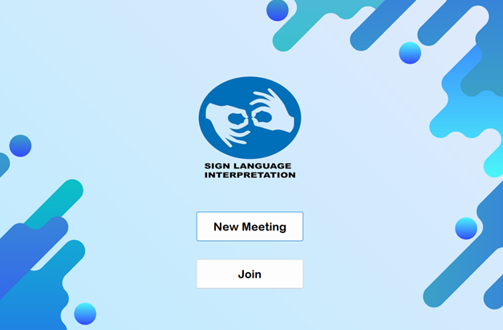
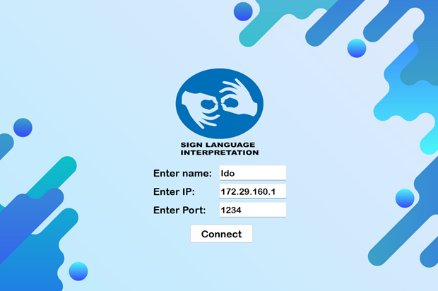
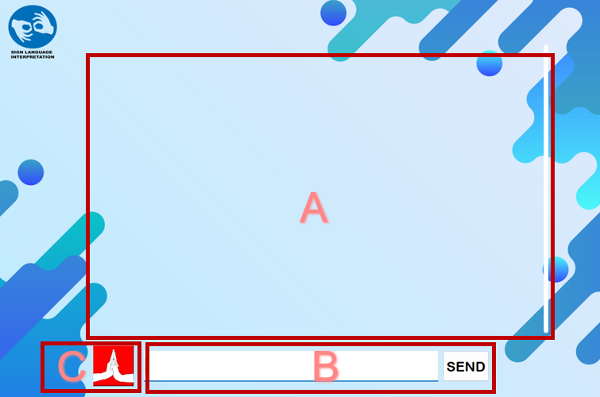

## _American sign language (ASL) to text conversion using CNN_


We propose an innovative ASL recognition chat application that addresses the significant communication barrier between ASL users and the hearing community. Using deep learning techniques, our system utilizes live video input from webcams to detect and interpret ASL gestures, converting them into text or voice output for improved understanding and communication. By leveraging YOLOv5 for efficient hand gesture detection and DenseNet with transfer learning for robust ASL recognition, our solution achieves superior performance with limited training data. Through the creation of the "ASL-DS" dataset and evaluation using experiment hyperparameters, our application promotes inclusive communication, social inclusion, and equal opportunities for all individuals, fostering effective and accessible communication between ASL users and the hearing population.

## Clone and Installation
- Clone the repository
```
git clone https://github.com/Michael2343/American-sign-language-ASL-to-text-conversion-using-CNN
```
- Goto the cloned folder.
```
cd ASL_Chat
```
- Install requirements with mentioned command below.
```
pip install -r requirements.txt # for pc with GPU
pip install -r requirementsCpu.txt # for pc without GPU
```

### The repository includes all YOLOv5 and DenseNet121 trained models, along with their respective weights and necessary data!

## Running the Application

- Run the GUI with mentioned command below.
```
python main.py
```

## Usage: Chat App Tutorial

1. Home Screen
    - “New Meeting”: This button allows users to initiate a new meeting session. 
    - “Join Meeting”: Users can opt to join an existing meeting session by clicking this button.



2. Connection screen (host):
    - After clicking “New Meeting”: User will be prompted to enter their desired username.
    After entering the username, then press “Start Session” Button and a new session will be created, This IP and port can be shared with others to join the meeting.


2. Connection screen (client):
    - After clicking “Join”: User will be prompted to enter their desired username and will be required to input the IP address and port number provided by the host of the meeting.
    


3. Chat screen
    - **A: Chat box** - All messages exchanged between users will be displayed here.
    - **B: Personal text area** - Users can input their messages here and send them by pressing the "Send" button or by pressing the ENTER key.
    - **C: Activate ASL Translator Button** - By activating this button, users can enable(green background)/disable(red background) the system to translate American Sign Language (ASL) gestures into text.



### Demo session (ASL translator is disable):
Working as a regular chat message application.


### Demo session (ASL translator is enable):

1. Letter detection: Accurately recognizes all ASL letters (A-Z).


2. Special character detection: Recognizes additional gestures for SPACE, DELETE, and ENTER functions.
    - SPACE: Adding a space between letters in the personal text area.
    - DELETE: This gesture allows users to delete the last letter in the personal text area.
    - ENTER: Users can send the text in the personal text area.


### References

- YOLOv5: [GitHub Repository](https://github.com/ultralytics/yolov5)
- DenseNet: [Understanding DenseNets](https://amaarora.github.io/posts/2020-08-02-densenets.html)
